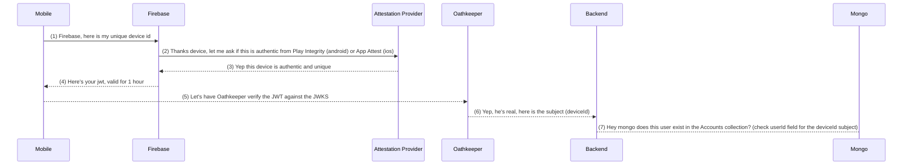

To create a JWKS (JSON Web Key Set) file, you'll first need to generate a public/private key pair (RSA or EC). You can use an existing pair or generate a new one. In this example, I will show you how to create an RSA key pair and then convert it into a JWKS file.

Generate an RSA key pair using OpenSSL:

```bash
openssl genpkey -algorithm RSA -out private_key.pem -pkeyopt rsa_keygen_bits:2048
openssl rsa -pubout -in private_key.pem -out public_key.pem
```

Install the jwk-to-pem and pem-jwk packages to convert between PEM and JWK:
```bash
npm install jwk-to-pem pem-jwk
```

Create a jwks-generator.js file and add the following code to convert the RSA public key to a JWK and create a JWKS file:

```js
const fs = require('fs');
const { RSA_PEM_to_JWK } = require('pem-jwk');

const publicKeyPem = fs.readFileSync('public_key.pem', 'utf8');
const jwk = RSA_PEM_to_JWK(publicKeyPem);

const jwks = {
  keys: [
    {
      kty: jwk.kty,
      n: jwk.n,
      e: jwk.e,
      alg: 'RS256',
      use: 'sig',
      kid: 'your-key-id', // Use a unique identifier for the key ID
    },
  ],
};

fs.writeFileSync('.well-known/jwks.json', JSON.stringify(jwks, null, 2));
console.log('JWKS file generated: .well-known/jwks.json');
```

Run the script:
```bash
node jwks-generator.js
```

After running the script, you should have a .well-known/jwks.json file that contains your JWKS. You can then serve this file using an HTTP server (such as Express) or upload it to a web server where your identity provider is hosted.

Keep in mind that the JWKS file should be accessible from the URL specified in your Oathkeeper configuration. Update the jwks_urls and trusted_issuers fields in the Oathkeeper configuration to match the actual URL of your identity provider and JWKS file.


## Device Login Flow


