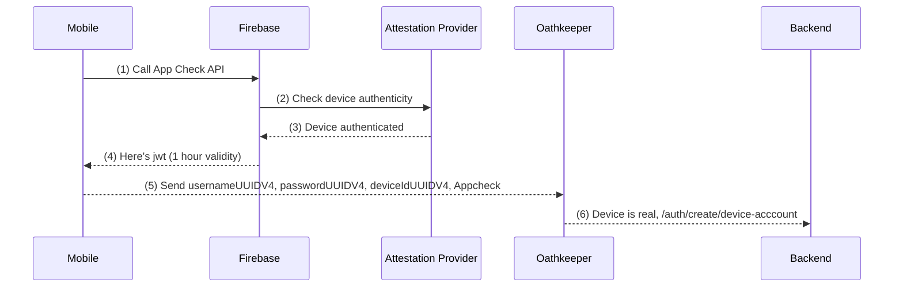

## Device Login Flow for App Check



## Device Account V3

New User/Password Flow
-----------------
1) get app-check jwt add to header `Appcheck`
2) mobile app generates locally a usernameUUIDV4, passwordUUIDV4, deviceIdUUIDV4 (or from keychain if uninstalled)
3) REST
```
POST `/auth/create/device-account`
Authorization: basic base64(username:password)
Appcheck: jwt
BODY {deviceId}
```
4) oathkeeper decision api to verify appcheck jwt via rule
- kratos will create identity with uuidv4Username and uuidV4Password
  -  In our backend store DeviceId in mongo user collection
- RETURN kratos session token
  - mobile app needs to backup usernameUUIDV4, passwordUUIDV4, deviceIdUUIDV4 to keychain

Upgrade To Phone Flow
-----------------
1) captcha flow in mobile app
2) grapqhl
```
Post /graphql MUTATION UserLoginUpgrade
Authorization: bearer kratosSessionToken
BODY: phone + code
```
3) backend
```
  isValid(code) then upgrade
    a) kratos add phone trait
    b) change scheme from "username_password_device_v0" to "phone_no_pasword_v0"
    c) change password from passwordUUIDV4 to KratosMasterPassword
```
RETURN kratos session token

## Gen Test JWT
To simulate logging in with a device account a helper function has been created in `dev/bin/gen-test-jwt`. If you run `make gen-test-jwt` it will generate a test jwt.

## Device Upgrade Flow

Here is a detailed explaination of the `loginUpgradeWithPhone` flow from `src/app/auth/login.ts`

### Scenario 1)
Phone account already exists (no txn with device acct) - User logs in with device account then he
wants to upgrade to a phone account that already exists. there are no txns on the device account.
Tell the user to logout and log back in with the phone account

### Scenario 1.5)
Phone account already exists (txns with device acct) - User logs in with device account (and does some txns) then he
wants to upgrade to a phone account that already exists.
throw an error stating that a phone account already exists and the user needs to manually sweep funds
to the new account. Here are the steps the user need to perform:
1. login with phone account and create an invoice (save this invoice)
2. logout of the phone account
3. login with device account (it should auto login)
4  Pay the invoice with max wallet amount.
5. Logout of the device account
6. Log into the phone account and check for the funds

** FUTURE USE CASE: is it a risk to have txn history persist if user sells phone?

** can a user manually sweep funds to new account then click a btn in the mobile app to delete device account?
               if device account bal is 0 and user clicks nuke account then delete kratos and mongo entries with
                      mutation nukeDeviceAccountMutation ?

### Scenario 2)
Happy Path - User logs in with device account, no phone account exists, upgrade device to phone account
a. update kratos => update schema to phone_no_password_v0, remove device trait
b. mongo (user) => update user collection and remove device field, add phone
c. mongo (account) => update account to level 1

### Scenario 3)
Unhappy path - User sells phone and forgets to sweep funds to phone account
- Option 1 - too bad, we can't help them
- Option 2 - create some kind of recovery code process?


## Other notes on jwts
To create a JWKS (JSON Web Key Set) file, you'll first need to generate a public/private key pair (RSA or EC). You can use an existing pair or generate a new one. In this example, I will show you how to create an RSA key pair and then convert it into a JWKS file.

Generate an RSA key pair using OpenSSL:

```bash
openssl genpkey -algorithm RSA -out private_key.pem -pkeyopt rsa_keygen_bits:2048
openssl rsa -pubout -in private_key.pem -out public_key.pem
```

Install the jwk-to-pem and pem-jwk packages to convert between PEM and JWK:
```bash
npm install jwk-to-pem pem-jwk
```

Create a jwks-generator.js file and add the following code to convert the RSA public key to a JWK and create a JWKS file:

```js
const fs = require('fs');
const { RSA_PEM_to_JWK } = require('pem-jwk');

const publicKeyPem = fs.readFileSync('public_key.pem', 'utf8');
const jwk = RSA_PEM_to_JWK(publicKeyPem);

const jwks = {
  keys: [
    {
      kty: jwk.kty,
      n: jwk.n,
      e: jwk.e,
      alg: 'RS256',
      use: 'sig',
      kid: 'your-key-id', // Use a unique identifier for the key ID
    },
  ],
};

fs.writeFileSync('.well-known/jwks.json', JSON.stringify(jwks, null, 2));
console.log('JWKS file generated: .well-known/jwks.json');
```

Run the script:
```bash
node jwks-generator.js
```

After running the script, you should have a .well-known/jwks.json file that contains your JWKS. You can then serve this file using an HTTP server (such as Express) or upload it to a web server where your identity provider is hosted.

The JWKS file should be accessible from the URL specified in your Oathkeeper configuration. Update the `jwks_urls` and `trusted_issuers` fields in the Oathkeeper configuration to match the actual URL of your identity provider and JWKS file.
